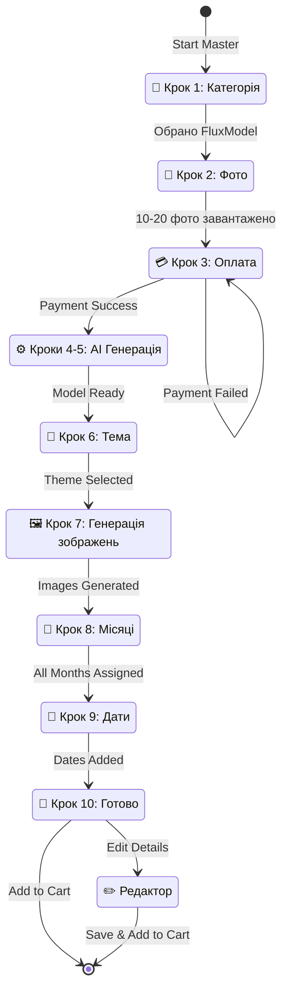
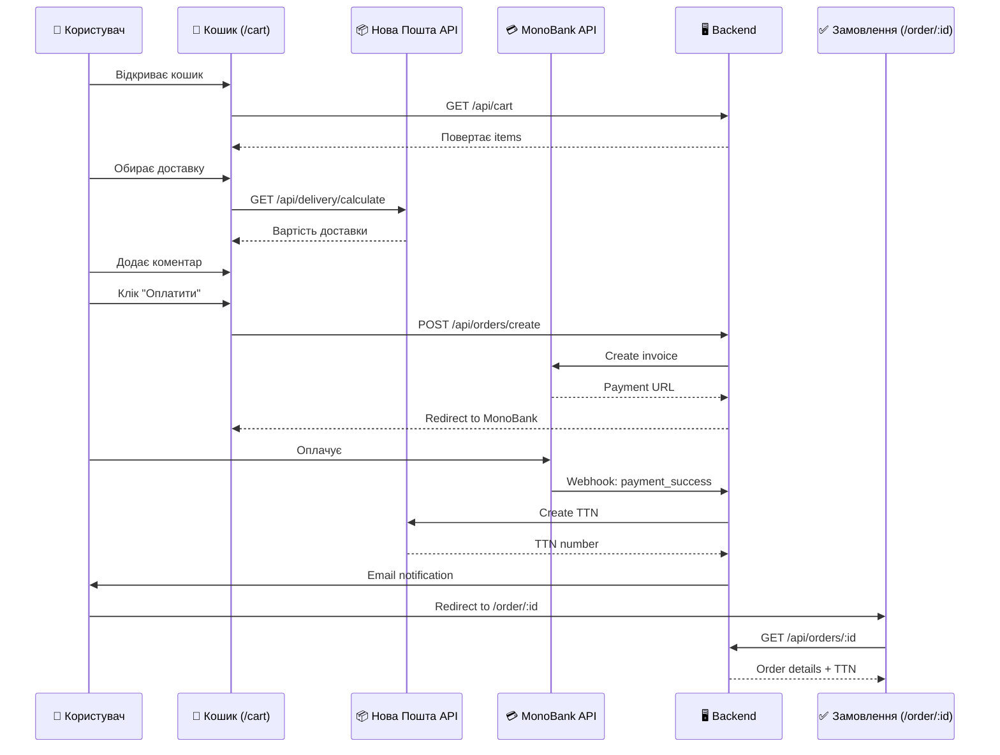
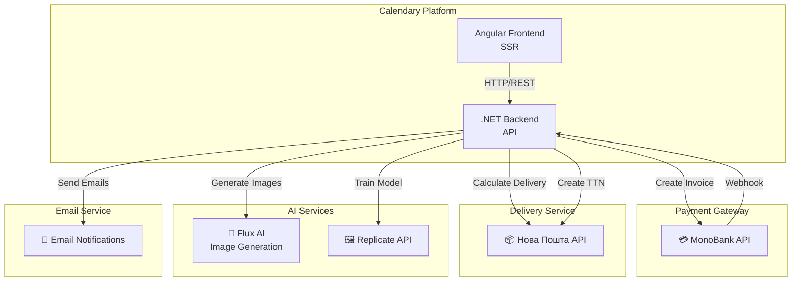
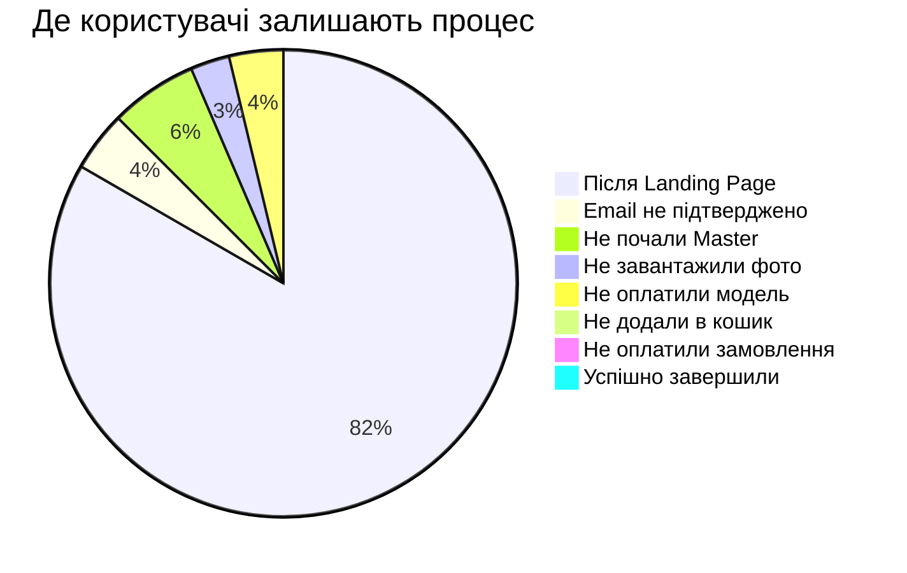

# User Journey Flow Diagram - Calendary

Візуальна діаграма користувацьких шляхів у форматі Mermaid.

## Основна воронка конверсії (Main User Flow)

```mermaid
graph TD
    %% Стилі
    classDef public fill:#e3f2fd,stroke:#1976d2,stroke-width:2px
    classDef protected fill:#fff3e0,stroke:#f57c00,stroke-width:2px
    classDef payment fill:#c8e6c9,stroke:#388e3c,stroke-width:3px
    classDef goal fill:#ffcdd2,stroke:#d32f2f,stroke-width:3px

    %% Публічна частина
    A[🏠 Головна сторінка<br/>'/' Landing Page] --> B{Користувач<br/>авторизований?}
    B -->|Ні| C[📝 Реєстрація<br/>'/register']
    C --> D[📧 Email верифікація<br/>'/verify/:token']
    D --> E[🔐 Логін<br/>'/login']
    B -->|Так| F
    E --> F[🎯 Майстер створення<br/>'/master']

    %% Wizard кроки
    F --> F1[Крок 1: Обрати категорію<br/>FluxModel]
    F1 --> F2[Крок 2: Завантажити фото<br/>10-20 зображень]
    F2 --> F3[💳 Крок 3: Оплата моделі<br/>MonoBank Payment #1]
    F3 --> G1{Оплата<br/>успішна?}

    G1 -->|Ні| F3
    G1 -->|Так| F4[🎯 GOAL 1: Model Paid<br/>Перша монетизація]

    F4 --> F5[⚙️ Крок 4-5: AI Генерація<br/>Тренування моделі]
    F5 --> F6[Крок 6: Обрати тему<br/>PromptTheme]
    F6 --> F7[🎨 Крок 7: Генерація зображень<br/>12+ AI images]
    F7 --> F8[📅 Крок 8: Місяці<br/>Розподіл зображень]
    F8 --> F9[📆 Крок 9: Важливі дати<br/>Дні народження тощо]
    F9 --> F10[🎉 Крок 10: Готово!<br/>Calendar Created]

    F10 --> G2{Редагувати<br/>детально?}
    G2 -->|Так| H[✏️ Редактор<br/>'/editor']
    G2 -->|Ні| I
    H --> I[🛒 Додати в кошик]

    I --> J[🛒 Кошик<br/>'/cart']
    J --> J1[Вибір доставки<br/>Нова Пошта API]
    J1 --> J2[Коментар до замовлення]
    J2 --> K[💳 Оплата замовлення<br/>MonoBank Payment #2]

    K --> L1{Оплата<br/>успішна?}
    L1 -->|Ні| K
    L1 -->|Так| L[🎯 GOAL 2: Order Paid<br/>Друга монетизація]

    L --> M[✅ Замовлення<br/>'/order/:id']
    M --> N[👤 Профіль<br/>'/profile']
    N --> O{Повторна<br/>покупка?}
    O -->|Так| F
    O -->|Ні| P[📊 End - Success]

    %% Застосування стилів
    class A,C,D,E public
    class F,F1,F2,F5,F6,F7,F8,F9,F10,H,J,J1,J2,M,N protected
    class F3,K payment
    class F4,L goal
```



## Детальна діаграма Master Wizard (10 кроків)



## E-commerce Flow (Кошик → Оплата)



## Метрики та цільові сторінки (Funnel Metrics)

```mermaid
graph LR
    A[1000 Landing<br/>Visitors] -->|20%| B[200<br/>Registrations]
    B -->|80%| C[160<br/>Email Verified]
    C -->|90%| D[144<br/>Logged In]
    D -->|60%| E[86<br/>Started Master]
    E -->|70%| F[60<br/>Uploaded Photos]
    F -->|40%| G[24<br/>💰 Model Paid]
    G -->|80%| H[19<br/>Calendar Created]
    H -->|60%| I[11<br/>Added to Cart]
    I -->|70%| J[8<br/>💰 Order Paid]

    style G fill:#c8e6c9,stroke:#388e3c,stroke-width:3px
    style J fill:#c8e6c9,stroke:#388e3c,stroke-width:3px

    J -.->|Overall| K[0.8%<br/>Conversion]
```



## Користувацькі ролі та доступи

```mermaid
graph TD
    A[Відвідувач<br/>Anonymous] -->|Реєстрація| B[Користувач<br/>User Role]
    B -->|Upgrade| C[Адміністратор<br/>Admin Role]

    A -.->|Доступ| A1[/ Home<br/>Login<br/>Register<br/>Forgot Password]

    B -.->|Доступ| B1[/ Master<br/>Editor<br/>Cart<br/>Order<br/>Profile]

    C -.->|Доступ| C1[/admin/*<br/>All Admin Pages<br/>+ User Pages]

    style A fill:#e3f2fd
    style B fill:#fff3e0
    style C fill:#ffebee
```

## Інтеграції з третіми сторонами



## Timeline користувацької подорожі

```mermaid
gantt
    title Типова користувацька подорож (User Journey Timeline)
    dateFormat HH:mm
    axisFormat %H:%M

    section Реєстрація
    Landing Page View          :00:00, 2m
    Registration              :00:02, 3m
    Email Verification        :00:05, 5m
    Login                     :00:10, 1m

    section Створення
    Start Master              :00:11, 2m
    Category Selection        :00:13, 2m
    Photo Upload              :00:15, 5m
    Model Payment             :00:20, 3m

    section AI Генерація
    Model Training Wait       :00:23, 30m
    View Results              :00:53, 3m

    section Персоналізація
    Theme Selection           :00:56, 2m
    Image Generation          :00:58, 10m
    Month Assignment          :01:08, 5m
    Important Dates           :01:13, 3m
    Calendar Preview          :01:16, 2m

    section Покупка
    Add to Cart               :01:18, 1m
    Choose Delivery           :01:19, 3m
    Order Payment             :01:22, 3m
    Order Confirmation        :01:25, 2m
```



## Drop-off Points (Критичні точки відмови)



---

## Як використовувати діаграми

### Перегляд у GitHub
Діаграми Mermaid автоматично рендеряться на GitHub при перегляді `.md` файлів.

### Локальний перегляд
1. Використовуйте VSCode з розширенням "Markdown Preview Mermaid Support"
2. Або онлайн редактор: https://mermaid.live/

### Експорт
- SVG: для презентацій
- PNG: для документації
- PDF: для друку

---

**Версія**: 1.0
**Дата**: 2025-11-16
**Автор**: Claude Code AI Team
