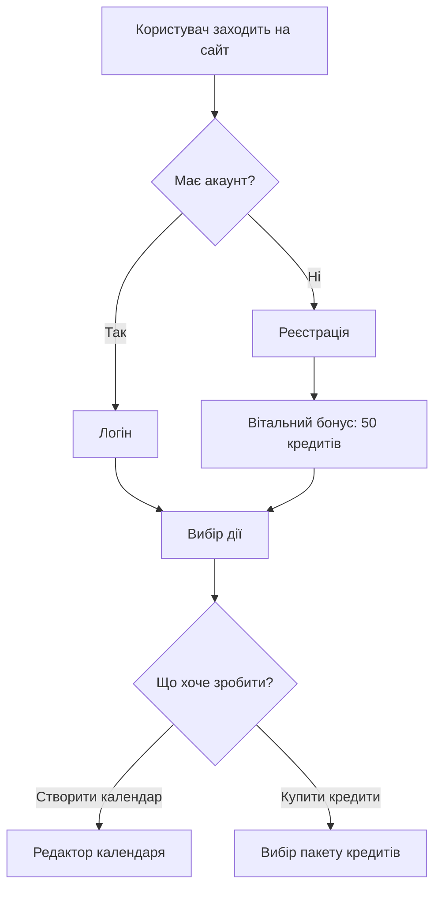
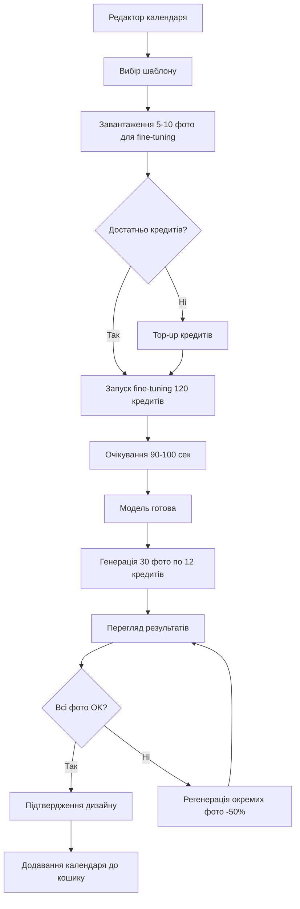
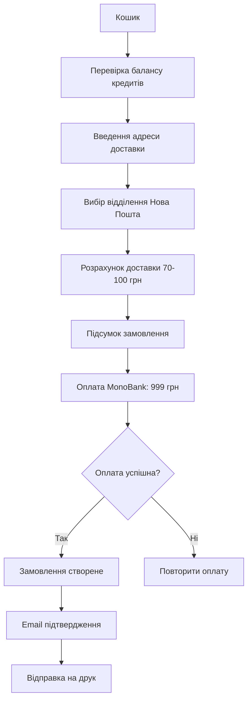
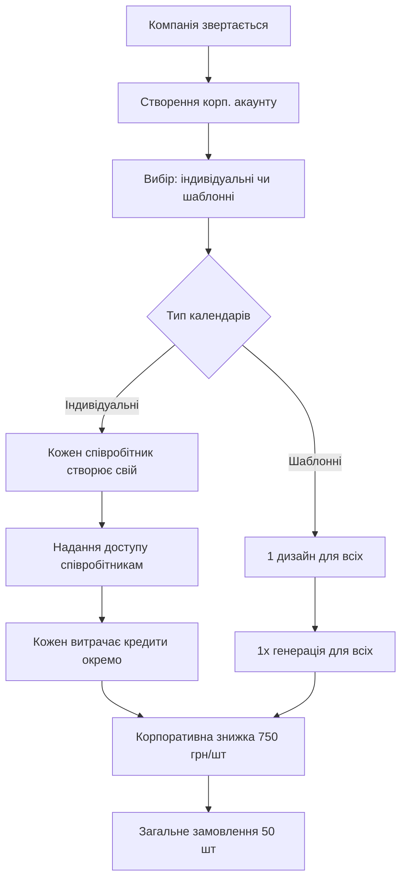

# Дуальна система монетизації: Кредити + Календар

## Дата створення: 2025-11-15

---

## Огляд системи

**Концепція:** Розділення монетизації на два незалежних компоненти:
1. **Кредити** - валюта для AI-генерації контенту (фото, моделі)
2. **Календар** - фіксована ціна за друк та доставку готового продукту

### Переваги дуальної системи
✅ Гнучка ціноутворення залежно від використання AI
✅ Прозорість витрат для користувача
✅ Можливість продажу кредитів окремо (top-up)
✅ Оптимізація маржі на різних етапах
✅ Підтримка різних AI-моделей з різною вартістю

---

## 1. Система кредитів

### 1.1 Визначення кредиту

**1 Кредит = 1 UAH вартості AI-генерації**

Це базова одиниця, яка мультиплікує наші реальні витрати на Replicate.

### 1.2 Вартість AI-операцій в кредитах

#### Генерація моделі (Fine-tuning)
```
Replicate вартість: $1.159 (95 сек × $0.0122/сек)
Курс: $1 = 41 грн
Реальна вартість: 47.5 грн

Мультиплікатор: 2.5x (для покриття ризиків + маржа)
Ціна для користувача: 120 кредитів
```

#### Генерація картинки (Flux - стандартна модель)
```
Replicate вартість: $0.1098 (9 сек × $0.0122/сек)
Курс: $1 = 41 грн
Реальна вартість: 4.5 грн

Мультиплікатор: 2.5x
Ціна для користувача: 12 кредитів
```

#### Генерація картинки (NanoBanana - швидка модель)
```
Replicate вартість: ~$0.02 (менше часу генерації)
Курс: $1 = 41 грн
Реальна вартість: 0.82 грн

Мультиплікатор: 3x (нижча якість, але швидше)
Ціна для користувача: 3 кредити
```

### 1.3 Прайс-лист кредитів

| AI Операція | Модель | Вартість (кредити) | Реальна вартість (грн) | Маржа |
|-------------|--------|-------------------|----------------------|-------|
| Fine-tuning моделі | Flux | 120 | 47.5 | 72.5 (152%) |
| Генерація фото | Flux | 12 | 4.5 | 7.5 (167%) |
| Генерація фото | NanoBanana | 3 | 0.82 | 2.18 (266%) |
| Регенерація фото | Будь-яка | -50% | - | - |

**Примітка:** Регенерація фото (якщо не сподобалось) коштує 50% від звичайної ціни.

### 1.4 Пакети кредитів

Користувачі можуть купувати кредити пакетами з бонусами:

| Пакет | Ціна (UAH) | Кредити | Бонус | Ефективна знижка |
|-------|-----------|---------|-------|-----------------|
| Starter | 100 | 100 | - | 0% |
| Basic | 300 | 320 | +20 | 6.7% |
| Standard | 500 | 550 | +50 | 10% |
| Premium | 1000 | 1150 | +150 | 15% |
| Business | 3000 | 3600 | +600 | 20% |

**Приклад:**
```
Користувач купує пакет "Standard" за 500 грн
Отримує: 550 кредитів

Може згенерувати:
- 4 моделі (4 × 120 = 480 кредитів)
- або 45 фото на Flux (45 × 12 = 540 кредитів)
- або 183 фото на NanoBanana (183 × 3 = 549 кредитів)
- або комбінацію
```

---

## 2. Ціна календаря

### 2.1 Базова ціна

**Календар: 999 UAH** (фіксована ціна)

Що включено:
- Друк календаря (високоякісний)
- Упаковка
- Доставка по Україні (Нова Пошта)
- Підтримка

**Що НЕ включено:**
- AI-генерація контенту (оплачується кредитами окремо)

### 2.2 Маркетингові акції

```
Звичайна ціна: 999 грн
Ранній доступ: 799 грн (-20%)
Корпоративні (10+ шт): 850 грн/шт (-15%)
Корпоративні (50+ шт): 750 грн/шт (-25%)
Корпоративні (100+ шт): індивідуальні умови
```

---

## 3. Розрахунок собівартості та маржі

### 3.1 Для 1 календаря (з AI-генерацією)

#### Сценарій 1: Користувач генерує 30 фото на Flux

**Витрати користувача:**
```
Кредити:
- Fine-tuning моделі: 120 кредитів
- 30 фото × 12 кредитів: 360 кредитів
- Врахування браку (40%): +12 фото × 12 = 144 кредитів
РАЗОМ кредити: 624 кредитів = 624 грн

Календар: 999 грн

ЗАГАЛЬНА ЦІНА: 1,623 грн
```

**Наші витрати:**
```
AI генерація:
- Fine-tuning: $1.159 × 41 = 47.5 грн
- 42 фото (з браком): $4.61 × 41 = 189 грн
Разом AI: 236.5 грн

Друк: 510 грн (поштучно) / 355 грн (оптом 20+ шт)
Payment processing (1.5%): 24.3 грн
Податки (6.5%): 64.9 грн

СОБІВАРТІСТЬ: 836 грн (поштучно) / 681 грн (оптом)
```

**Маржа:**
```
Поштучно: 1,623 - 836 = 787 грн (94% маржа)
Оптом: 1,623 - 681 = 942 грн (138% маржа)
```

#### Сценарій 2: Користувач генерує 30 фото на NanoBanana

**Витрати користувача:**
```
Кредити:
- Fine-tuning моделі: 120 кредитів
- 30 фото × 3 кредитів: 90 кредитів
- Врахування браку (40%): +12 фото × 3 = 36 кредитів
РАЗОМ кредити: 246 кредитів = 246 грн

Календар: 999 грн

ЗАГАЛЬНА ЦІНА: 1,245 грн
```

**Наші витрати:**
```
AI генерація (NanoBanana):
- Fine-tuning: 47.5 грн (якщо є fine-tuning)
- 42 фото: ~34.5 грн (42 × $0.02 × 41)
Разом AI: 82 грн

Друк: 510 грн (поштучно) / 355 грн (оптом)
Payment processing: 18.7 грн
Податки: 64.9 грн

СОБІВАРТІСТЬ: 675.6 грн (поштучно) / 520.6 грн (оптом)
```

**Маржа:**
```
Поштучно: 1,245 - 675.6 = 569.4 грн (84% маржа)
Оптом: 1,245 - 520.6 = 724.4 грн (139% маржа)
```

### 3.2 Порівняльна таблиця сценаріїв

| Сценарій | Ціна для клієнта | Собівартість | Маржа (грн) | Маржа (%) |
|----------|-----------------|-------------|------------|----------|
| Flux (поштучно) | 1,623 | 836 | 787 | 94% |
| Flux (оптом 20+) | 1,623 | 681 | 942 | 138% |
| NanoBanana (поштучно) | 1,245 | 675.6 | 569.4 | 84% |
| NanoBanana (оптом 20+) | 1,245 | 520.6 | 724.4 | 139% |

**Висновок:** При оптових замовленнях (20+ календарів) маржа значно зростає (~140%).

---

## 4. Happy Flow користувача

### 4.1 Реєстрація та перший досвід



**Деталі:**
1. Користувач реєструється
2. Отримує **вітальний бонус 50 кредитів** (можна згенерувати 4 фото на Flux або 16 на NanoBanana)
3. Переходить до редактора календаря

### 4.2 Створення календаря (Happy Path)



**Деталі кроків:**

#### Крок 1: Вибір шаблону
- Користувач обирає тип календаря (настінний А3, настільний, планер)
- Вибирає тему (мінімалізм, класика, сучасний)

#### Крок 2: Завантаження фото
- Завантажує 5-10 якісних фото себе/домашнього улюбленця/пейзажів
- Система валідує якість (мінімум 1024x1024)
- Показує попередню оцінку кількості кредитів

#### Крок 3: Перевірка балансу кредитів
```
Потрібно для 30 фото (Flux):
- Fine-tuning: 120 кредитів
- 30 фото: 360 кредитів
- Резерв на регенерацію: ~100 кредитів
РАЗОМ: ~580 кредитів

Поточний баланс: 50 кредитів (вітальний бонус)

❌ Недостатньо! Потрібно докупити: 530 кредитів
✅ Рекомендація: Пакет "Standard" (550 кредитів за 500 грн)
```

#### Крок 4: Купівля кредитів (Top-up)
```
Користувач переходить на сторінку покупки кредитів
Вибирає пакет "Standard" (500 грн → 550 кредитів)
Оплачує через MonoBank
Баланс оновлюється: 50 + 550 = 600 кредитів
Повертається до редактора
```

#### Крок 5: Fine-tuning моделі
```
Натискає "Розпочати генерацію"
Система:
1. Списує 120 кредитів
2. Відправляє фото на Replicate
3. Запускає fine-tuning
4. Показує прогрес-бар (90-100 сек)

Користувач бачить:
"Створюємо вашу персональну AI-модель... ⏳
Залишилось: ~80 сек
Баланс: 480 кредитів"
```

#### Крок 6: Генерація 30 фото
```
Модель готова! ✅
Тепер генеруємо 30 унікальних фото для календаря...

Для кожного місяця:
- Січень: тема "Зима" → 12 кредитів
- Лютий: тема "День Валентина" → 12 кредитів
...

Прогрес: [█████████░░] 75% (23/30)
Баланс: 204 кредити
```

#### Крок 7: Перегляд та регенерація
```
Всі 30 фото згенеровані!
Користувач переглядає результат.

Грудень: фото не дуже подобається ❌
Натискає "Регенерувати" → списується 6 кредитів (-50%)
Нове фото генерується → OK ✅

Фінальний баланс: 198 кредитів
```

#### Крок 8: Додавання до кошику
```
Користувач підтверджує дизайн
Календар додається до кошику

Кошик:
├── Календар А3 (настінний): 999 грн
├── AI-генерація: 402 кредити використано
└── Доставка: розраховується при checkout
```

### 4.3 Checkout та оплата



**Деталі:**

#### Checkout екран
```
Підсумок замовлення:
────────────────────────────────
Календар А3 (настінний)       999 грн
AI-генерація                  ✅ Сплачено кредитами (402)
Доставка (Нова Пошта, Київ)    85 грн
────────────────────────────────
РАЗОМ:                      1,084 грн

Ваш баланс кредитів: 198 (залишок)

[Оплатити через MonoBank] 💳
```

#### Підтвердження
```
Email користувачу:
────────────────────────────────
✅ Замовлення #12345 прийнято!

Календар А3 (настінний) - 999 грн
Доставка: Київ, відділення #157 - 85 грн

Статус: Відправлено на друк 🖨️
Очікуваний термін: 4-5 робочих днів

Ваш баланс кредитів: 198

Дякуємо! 🎉
────────────────────────────────
```

---

## 5. Альтернативні кейси (Edge Cases)

### 5.1 Недостатньо кредитів під час генерації

**Сценарій:**
Користувач має 200 кредитів, запустив fine-tuning (120 кредитів), залишилось 80.
Тепер хоче згенерувати 30 фото × 12 = 360 кредитів, але має лише 80.

**Рішення:**
```
Після fine-tuning:
"Fine-tuning завершено! ✅
Ваш баланс: 80 кредитів

Для генерації 30 фото потрібно 360 кредитів.
❌ Недостатньо кредитів!

Варіанти:
1. Згенерувати частково (6 фото за 80 кредитів)
2. Купити кредити зараз (+280 кредитів = 300 грн)
3. Використати NanoBanana (30 фото = 90 кредитів ✅)

Рекомендація: NanoBanana швидше та дешевше! 🚀
```

**Користувач обирає NanoBanana:**
```
✅ Переключено на NanoBanana
Генерація 30 фото: 90 кредитів
Після генерації залишиться: 80 - 90 = -10

Потрібно докупити: 10 кредитів (мінімум 100 грн)
[Купити 100 кредитів - 100 грн]
```

### 5.2 Корпоративне замовлення (bulk)

**Сценарій:**
Компанія хоче замовити 50 календарів для співробітників.

**Флоу:**


**Розрахунок для корпорації:**

**Варіант 1: Шаблонний дизайн (1 AI-генерація для всіх)**
```
Кредити:
- Fine-tuning: 120 кредитів
- 30 фото Flux: 360 кредитів
Разом: 480 кредитів = 480 грн

Календарі:
- 50 шт × 750 грн = 37,500 грн

РАЗОМ: 37,980 грн
На 1 календар: 759.6 грн
```

**Варіант 2: Індивідуальні дизайни (50 AI-генерацій)**
```
Кредити:
- 50 × 480 кредитів = 24,000 кредитів
- Пакет Business (3,000 грн → 3,600 кредитів) × 7 = 21,000 грн
  (отримують 25,200 кредитів)

Календарі:
- 50 шт × 750 грн = 37,500 грн

РАЗОМ: 58,500 грн
На 1 календар: 1,170 грн
```

**Рекомендація:** Шаблонний дизайн економить 20,520 грн!

### 5.3 Користувач хоче календар без AI (свої фото)

**Сценарій:**
У користувача вже є 30 якісних фото, не потрібна AI-генерація.

**Флоу:**
```
1. Вибір шаблону
2. Завантаження 30 готових фото
3. Розміщення на календарі
4. Підтвердження

Кредити: 0 (не використовуються)
Ціна: 999 грн (тільки календар)
```

**Маржа для нас:**
```
Собівартість: 510 + 7.5 + 32.5 = 550 грн
Ціна: 999 грн
Маржа: 449 грн (82%)
```

**Чому це вигідно:**
- Немає витрат на AI
- Швидше виконання
- Все одно хороша маржа

### 5.4 Користувач генерував фото, але вирішив не купувати календар

**Сценарій:**
Користувач витратив 480 кредитів на генерацію, але передумав купувати календар.

**Що відбувається:**
```
Кредити: списані (480 використано)
Згенеровані фото: зберігаються в акаунті
Календар: не оплачений

Опції:
1. Завантажити фото для використання в інших проєктах
2. Створити календар пізніше (без повторної генерації)
3. Поділитися дизайном з друзями (реферальна програма)
```

**Монетизація:**
```
Кредити вже сплачено → дохід отриманий ✅
Користувач може повернутись пізніше
Фото зберігаються 1 рік
```

### 5.5 Користувач хоче PDF для самостійного друку

**Сценарій:**
Користувач згенерував календар, але хоче роздрукувати сам (дешевше).

**Флоу:**
```
1. Створення дизайну (кредити списані)
2. Підтвердження дизайну
3. Вибір: "Друк та доставка" або "Завантажити PDF"

Опція "Завантажити PDF":
- Ціна: 299 грн (замість 999 грн)
- Включає: високоякісний PDF для друку
- Не включає: фізичний друк та доставку
```

**Маржа:**
```
Собівартість PDF: ~0 грн (тільки генерація файлу)
Ціна: 299 грн
Маржа: 299 грн (100%)
```

**Плюси:**
- Додатковий revenue stream
- Мінімальна собівартість
- Розширення аудиторії

---

## 6. Бізнес-логіка та правила

### 6.1 Правила нарахування кредитів

**Вітальний бонус:**
```
При реєстрації: +50 кредитів
Після першого замовлення: +100 кредитів
День народження: +50 кредитів/рік
```

**Реферальна програма:**
```
Запросив друга: +100 кредитів (після першого замовлення друга)
Друг отримує: +50 кредитів додатково до вітального бонусу
```

**Програма лояльності:**
```
Кожне 5-те замовлення: +200 кредитів
Кожне 10-те замовлення: +500 кредитів
Річна підписка (999 грн/рік): +1000 кредитів щомісяця
```

### 6.2 Правила витрачання кредитів

**Пріоритет списання:**
1. Бонусні кредити (спочатку витрачаються бонуси)
2. Куплені кредити (потім куплені)

**Термін дії:**
```
Куплені кредити: безстрокові
Бонусні кредити: 12 місяців з моменту нарахування
```

**Повернення:**
```
Кредити НЕ повертаються у гривнях
Можна передати іншому користувачу (Gift опція)
```

### 6.3 Антифрод правила

**Ліміти на день:**
```
Новий користувач:
- Максимум 3 fine-tuning на день
- Максимум 100 фото на день

Верифікований користувач:
- Максимум 10 fine-tuning на день
- Максимум 300 фото на день

Корпоративний акаунт:
- Без лімітів
```

**Детекція зловживань:**
```
Якщо >70% фото регенеруються → блокування на 24 год
Якщо підозра на abuse → перегляд адміном
```

---

## 7. Технічна реалізація

### 7.1 Database Schema

#### Таблиця: Credits
```sql
CREATE TABLE Credits (
    Id UNIQUEIDENTIFIER PRIMARY KEY,
    UserId UNIQUEIDENTIFIER NOT NULL,
    Amount INT NOT NULL,
    Type VARCHAR(20) NOT NULL, -- 'purchased', 'bonus', 'referral'
    ExpiresAt DATETIME2 NULL,
    CreatedAt DATETIME2 NOT NULL,
    FOREIGN KEY (UserId) REFERENCES Users(Id)
);
```

#### Таблиця: CreditTransactions
```sql
CREATE TABLE CreditTransactions (
    Id UNIQUEIDENTIFIER PRIMARY KEY,
    UserId UNIQUEIDENTIFIER NOT NULL,
    Amount INT NOT NULL, -- позитивне = зарахування, негативне = списання
    Type VARCHAR(50) NOT NULL, -- 'fine_tuning', 'image_generation', 'purchase', 'bonus'
    Description NVARCHAR(500),
    OrderId UNIQUEIDENTIFIER NULL,
    CreatedAt DATETIME2 NOT NULL,
    FOREIGN KEY (UserId) REFERENCES Users(Id),
    FOREIGN KEY (OrderId) REFERENCES Orders(Id)
);
```

#### Таблиця: CreditPackages
```sql
CREATE TABLE CreditPackages (
    Id UNIQUEIDENTIFIER PRIMARY KEY,
    Name NVARCHAR(100) NOT NULL,
    Credits INT NOT NULL,
    BonusCredits INT NOT NULL,
    PriceUAH DECIMAL(10,2) NOT NULL,
    IsActive BIT NOT NULL,
    CreatedAt DATETIME2 NOT NULL
);

-- Seed data
INSERT INTO CreditPackages VALUES
(NEWID(), 'Starter', 100, 0, 100.00, 1, GETDATE()),
(NEWID(), 'Basic', 300, 20, 300.00, 1, GETDATE()),
(NEWID(), 'Standard', 500, 50, 500.00, 1, GETDATE()),
(NEWID(), 'Premium', 1000, 150, 1000.00, 1, GETDATE()),
(NEWID(), 'Business', 3000, 600, 3000.00, 1, GETDATE());
```

#### Таблиця: AIGenerations
```sql
CREATE TABLE AIGenerations (
    Id UNIQUEIDENTIFIER PRIMARY KEY,
    UserId UNIQUEIDENTIFIER NOT NULL,
    OrderId UNIQUEIDENTIFIER NULL,
    Type VARCHAR(20) NOT NULL, -- 'fine_tuning', 'image'
    Model VARCHAR(50) NOT NULL, -- 'flux', 'nanobanana'
    CreditsUsed INT NOT NULL,
    Status VARCHAR(20) NOT NULL, -- 'pending', 'processing', 'completed', 'failed'
    ResultUrl NVARCHAR(500) NULL,
    CreatedAt DATETIME2 NOT NULL,
    CompletedAt DATETIME2 NULL,
    FOREIGN KEY (UserId) REFERENCES Users(Id),
    FOREIGN KEY (OrderId) REFERENCES Orders(Id)
);
```

### 7.2 API Endpoints

#### Credit Management
```csharp
// GET /api/credits/balance
public async Task<ActionResult<CreditBalanceDto>> GetBalance()
{
    var balance = await _creditService.GetUserBalance(UserId);
    return Ok(new CreditBalanceDto
    {
        Total = balance.Total,
        Purchased = balance.Purchased,
        Bonus = balance.Bonus,
        ExpiringIn30Days = balance.ExpiringIn30Days
    });
}

// GET /api/credits/packages
public async Task<ActionResult<List<CreditPackageDto>>> GetPackages()
{
    var packages = await _creditService.GetActivePackages();
    return Ok(packages);
}

// POST /api/credits/purchase
public async Task<ActionResult<PurchaseResultDto>> PurchasePackage(
    [FromBody] PurchaseCreditPackageRequest request)
{
    var result = await _creditService.PurchasePackage(
        UserId,
        request.PackageId,
        request.PaymentMethodId
    );
    return Ok(result);
}

// GET /api/credits/transactions
public async Task<ActionResult<PagedList<CreditTransactionDto>>> GetTransactions(
    [FromQuery] PaginationParams pagination)
{
    var transactions = await _creditService.GetUserTransactions(
        UserId,
        pagination
    );
    return Ok(transactions);
}
```

#### AI Generation
```csharp
// POST /api/ai/fine-tune
public async Task<ActionResult<FineTuneResultDto>> FineTune(
    [FromForm] FineTuneRequest request)
{
    // Перевірка балансу
    var hasCredits = await _creditService.HasEnoughCredits(
        UserId,
        120 // вартість fine-tuning
    );

    if (!hasCredits)
        return BadRequest("Insufficient credits");

    // Списання кредитів
    await _creditService.DeductCredits(
        UserId,
        120,
        "fine_tuning",
        "Fine-tuning model"
    );

    // Запуск генерації
    var result = await _aiService.StartFineTuning(
        UserId,
        request.Images
    );

    return Ok(result);
}

// POST /api/ai/generate-image
public async Task<ActionResult<GenerateImageResultDto>> GenerateImage(
    [FromBody] GenerateImageRequest request)
{
    // Розрахунок вартості
    int credits = request.Model == "flux" ? 12 : 3;

    if (request.IsRegeneration)
        credits = credits / 2;

    // Перевірка та списання
    var hasCredits = await _creditService.HasEnoughCredits(UserId, credits);
    if (!hasCredits)
        return BadRequest("Insufficient credits");

    await _creditService.DeductCredits(
        UserId,
        credits,
        "image_generation",
        $"Generate image with {request.Model}"
    );

    // Генерація
    var result = await _aiService.GenerateImage(
        UserId,
        request.ModelId,
        request.Prompt,
        request.Model
    );

    return Ok(result);
}
```

### 7.3 Credit Service Implementation

```csharp
public class CreditService : ICreditService
{
    private readonly ApplicationDbContext _context;
    private readonly IMonobankService _monobankService;

    public async Task<CreditBalance> GetUserBalance(Guid userId)
    {
        var now = DateTime.UtcNow;

        var purchased = await _context.Credits
            .Where(c => c.UserId == userId && c.Type == "purchased")
            .SumAsync(c => c.Amount);

        var bonus = await _context.Credits
            .Where(c => c.UserId == userId
                && c.Type != "purchased"
                && (c.ExpiresAt == null || c.ExpiresAt > now))
            .SumAsync(c => c.Amount);

        var used = await _context.CreditTransactions
            .Where(t => t.UserId == userId && t.Amount < 0)
            .SumAsync(t => Math.Abs(t.Amount));

        var expiringIn30Days = await _context.Credits
            .Where(c => c.UserId == userId
                && c.Type != "purchased"
                && c.ExpiresAt != null
                && c.ExpiresAt <= now.AddDays(30)
                && c.ExpiresAt > now)
            .SumAsync(c => c.Amount);

        return new CreditBalance
        {
            Total = purchased + bonus - used,
            Purchased = purchased,
            Bonus = bonus,
            ExpiringIn30Days = expiringIn30Days
        };
    }

    public async Task<bool> HasEnoughCredits(Guid userId, int amount)
    {
        var balance = await GetUserBalance(userId);
        return balance.Total >= amount;
    }

    public async Task DeductCredits(
        Guid userId,
        int amount,
        string type,
        string description)
    {
        // Спочатку списуємо бонусні (ті, що скоро закінчуються)
        var bonusCredits = await _context.Credits
            .Where(c => c.UserId == userId && c.Type != "purchased")
            .OrderBy(c => c.ExpiresAt ?? DateTime.MaxValue)
            .ToListAsync();

        int remaining = amount;

        foreach (var credit in bonusCredits)
        {
            if (remaining <= 0) break;

            int toDeduct = Math.Min(credit.Amount, remaining);
            credit.Amount -= toDeduct;
            remaining -= toDeduct;

            if (credit.Amount == 0)
                _context.Credits.Remove(credit);
        }

        // Якщо бонусів не вистачило, списуємо куплені
        if (remaining > 0)
        {
            var purchasedCredits = await _context.Credits
                .Where(c => c.UserId == userId && c.Type == "purchased")
                .FirstOrDefaultAsync();

            if (purchasedCredits == null || purchasedCredits.Amount < remaining)
                throw new InsufficientCreditsException();

            purchasedCredits.Amount -= remaining;
        }

        // Записуємо транзакцію
        _context.CreditTransactions.Add(new CreditTransaction
        {
            Id = Guid.NewGuid(),
            UserId = userId,
            Amount = -amount,
            Type = type,
            Description = description,
            CreatedAt = DateTime.UtcNow
        });

        await _context.SaveChangesAsync();
    }

    public async Task<PurchaseResult> PurchasePackage(
        Guid userId,
        Guid packageId,
        string paymentMethodId)
    {
        var package = await _context.CreditPackages
            .FindAsync(packageId);

        if (package == null || !package.IsActive)
            throw new InvalidPackageException();

        // Створення платежу через MonoBank
        var payment = await _monobankService.CreatePayment(
            userId,
            package.PriceUAH,
            $"Purchase {package.Name} credit package"
        );

        return new PurchaseResult
        {
            PaymentUrl = payment.PaymentUrl,
            PaymentId = payment.Id
        };
    }

    // Webhook від MonoBank після успішної оплати
    public async Task ProcessSuccessfulPayment(Guid paymentId)
    {
        var payment = await _monobankService.GetPayment(paymentId);
        var package = await _context.CreditPackages
            .FindAsync(payment.PackageId);

        // Додаємо куплені кредити
        _context.Credits.Add(new Credit
        {
            Id = Guid.NewGuid(),
            UserId = payment.UserId,
            Amount = package.Credits,
            Type = "purchased",
            ExpiresAt = null,
            CreatedAt = DateTime.UtcNow
        });

        // Додаємо бонусні кредити
        if (package.BonusCredits > 0)
        {
            _context.Credits.Add(new Credit
            {
                Id = Guid.NewGuid(),
                UserId = payment.UserId,
                Amount = package.BonusCredits,
                Type = "bonus",
                ExpiresAt = DateTime.UtcNow.AddYears(1),
                CreatedAt = DateTime.UtcNow
            });
        }

        // Записуємо транзакції
        _context.CreditTransactions.Add(new CreditTransaction
        {
            Id = Guid.NewGuid(),
            UserId = payment.UserId,
            Amount = package.Credits + package.BonusCredits,
            Type = "purchase",
            Description = $"Purchased {package.Name} package",
            CreatedAt = DateTime.UtcNow
        });

        await _context.SaveChangesAsync();
    }
}
```

### 7.4 Frontend компоненти (React приклади)

#### Credit Balance Widget
```typescript
// components/CreditBalance.tsx
import { useQuery } from '@tanstack/react-query';
import { api } from '@/lib/api';

export function CreditBalance() {
  const { data: balance } = useQuery({
    queryKey: ['credits', 'balance'],
    queryFn: () => api.credits.getBalance(),
  });

  return (
    <div className="credit-balance">
      <div className="total">
        <span className="amount">{balance?.total || 0}</span>
        <span className="label">Кредитів</span>
      </div>

      {balance?.expiringIn30Days > 0 && (
        <div className="expiring-warning">
          ⚠️ {balance.expiringIn30Days} кредитів згорять через 30 днів
        </div>
      )}

      <button onClick={() => navigate('/credits/buy')}>
        Купити кредити
      </button>
    </div>
  );
}
```

#### Credit Package Selection
```typescript
// components/CreditPackages.tsx
import { useQuery, useMutation } from '@tanstack/react-query';
import { api } from '@/lib/api';

export function CreditPackages() {
  const { data: packages } = useQuery({
    queryKey: ['credits', 'packages'],
    queryFn: () => api.credits.getPackages(),
  });

  const purchaseMutation = useMutation({
    mutationFn: (packageId: string) =>
      api.credits.purchasePackage(packageId),
    onSuccess: (data) => {
      // Redirect до MonoBank для оплати
      window.location.href = data.paymentUrl;
    },
  });

  return (
    <div className="credit-packages">
      <h2>Оберіть пакет кредитів</h2>

      <div className="packages-grid">
        {packages?.map(pkg => (
          <div key={pkg.id} className="package-card">
            <div className="package-name">{pkg.name}</div>

            <div className="credits">
              <span className="amount">{pkg.credits}</span>
              {pkg.bonusCredits > 0 && (
                <span className="bonus">+{pkg.bonusCredits} бонус</span>
              )}
            </div>

            <div className="price">{pkg.priceUAH} грн</div>

            {pkg.bonusCredits > 0 && (
              <div className="discount">
                Знижка {Math.round(pkg.bonusCredits / pkg.credits * 100)}%
              </div>
            )}

            <button
              onClick={() => purchaseMutation.mutate(pkg.id)}
              disabled={purchaseMutation.isPending}
            >
              Купити
            </button>
          </div>
        ))}
      </div>
    </div>
  );
}
```

#### AI Generation with Credit Check
```typescript
// components/CalendarEditor/GenerateButton.tsx
import { useMutation, useQuery } from '@tanstack/react-query';
import { api } from '@/lib/api';

export function GenerateButton({ model, onSuccess }) {
  const { data: balance } = useQuery({
    queryKey: ['credits', 'balance'],
    queryFn: () => api.credits.getBalance(),
  });

  const creditsNeeded = model === 'flux' ? 12 : 3;
  const hasEnoughCredits = (balance?.total || 0) >= creditsNeeded;

  const generateMutation = useMutation({
    mutationFn: () => api.ai.generateImage({ model }),
    onSuccess,
    onError: (error) => {
      if (error.code === 'INSUFFICIENT_CREDITS') {
        navigate('/credits/buy');
      }
    },
  });

  return (
    <div>
      <button
        onClick={() => generateMutation.mutate()}
        disabled={!hasEnoughCredits || generateMutation.isPending}
      >
        {generateMutation.isPending ? (
          'Генерація...'
        ) : (
          `Згенерувати (${creditsNeeded} кредитів)`
        )}
      </button>

      {!hasEnoughCredits && (
        <div className="error">
          Недостатньо кредитів. Потрібно: {creditsNeeded}, є: {balance?.total || 0}
          <button onClick={() => navigate('/credits/buy')}>
            Купити кредити
          </button>
        </div>
      )}
    </div>
  );
}
```

---

## 8. Аналітика та метрики

### 8.1 Ключові метрики для відстеження

**Revenue метрики:**
```
- MRR (Monthly Recurring Revenue) з кредитів
- MRR з календарів
- ARPU (Average Revenue Per User)
- Credits ARPU (середні витрати на кредити)
- Calendar ARPU (середні витрати на календарі)
```

**Engagement метрики:**
```
- Credit purchase rate (% користувачів, які купують кредити)
- Credits per order (скільки кредитів витрачають на 1 замовлення)
- Regeneration rate (% регенерованих фото)
- Model preference (Flux vs NanoBanana)
```

**Конверсія:**
```
- Visit → Registration: X%
- Registration → First Credit Purchase: Y%
- Credit Purchase → Calendar Order: Z%
- First Order → Repeat Order: W%
```

### 8.2 Dashboard для адміна

**Метрики в реальному часі:**
```
Сьогодні:
├── Продано кредитів: 15,000 (10,500 грн)
├── Витрачено кредитів: 12,300
├── Залишок у користувачів: 245,000
├── Продано календарів: 18 (17,982 грн)
└── AI витрати: 3,240 грн

Маржа на кредитах: 7,260 грн (69%)
Маржа на календарях: 9,870 грн (55%)
Загальна маржа: 17,130 грн (60%)
```

---

## 9. FAQ та Best Practices

### FAQ для користувачів

**Q: Чи згорають куплені кредити?**
A: Ні, куплені кредити безстрокові. Тільки бонусні згорають через 12 місяців.

**Q: Чи можу я повернути кредити в гроші?**
A: Ні, кредити не повертаються. Але ви можете передати їх іншому користувачу як подарунок.

**Q: Чому на NanoBanana менше кредитів?**
A: NanoBanana - швидша та дешевша модель, але якість трохи нижча. Flux дає кращу деталізацію.

**Q: Скільки кредитів потрібно на 1 календар?**
A: Залежить від моделі:
- Flux: ~580 кредитів (з резервом)
- NanoBanana: ~250 кредитів (з резервом)

**Q: Чи можу я створити календар без AI?**
A: Так! Якщо у вас вже є фото, просто завантажте їх - кредити не потрібні.

### Best Practices для розробки

**Транзакційність:**
```csharp
// Завжди використовуйте транзакції для списання кредитів
using var transaction = await _context.Database.BeginTransactionAsync();
try
{
    await _creditService.DeductCredits(...);
    await _aiService.StartGeneration(...);
    await transaction.CommitAsync();
}
catch
{
    await transaction.RollbackAsync();
    throw;
}
```

**Idempotency:**
```csharp
// Генерація повинна бути idempotent (можна повторити безпечно)
public async Task<string> GenerateImage(Guid requestId, ...)
{
    var existing = await _context.AIGenerations
        .FirstOrDefaultAsync(g => g.RequestId == requestId);

    if (existing != null)
        return existing.ResultUrl; // Вже згенеровано

    // ... генерація
}
```

**Rate Limiting:**
```csharp
// Обмеження кількості запитів
[RateLimit(requests: 10, period: "1m")]
public async Task<ActionResult> GenerateImage(...)
{
    // ...
}
```

---

## 10. Roadmap та майбутні покращення

### Phase 1 (MVP): Базова система кредитів ✅
- Купівля пакетів кредитів
- Списання за AI-генерацію
- Flux та NanoBanana підтримка
- Баланс та історія транзакцій

### Phase 2: Розширена монетизація
- Subscription модель (місячна підписка з кредитами)
- Gift cards (подарункові кредити)
- Corporate packages (для B2B)
- Seasonal promotions (знижки на свята)

### Phase 3: Геймфікація
- Досягнення (badges за певні активності)
- Leaderboard (топ користувачів за витраченими кредитами)
- Challenges (виклики за кредити)
- Streak rewards (щоденні бонуси)

### Phase 4: API та партнерства
- Public API для партнерів
- Whitelabel рішення
- Інтеграція з е-commerce платформами
- Розширення на інші print-on-demand продукти

---

## Висновки

Дуальна система **Кредити + Календар** дає нам:

✅ **Прозорість** - користувач бачить скільки коштує AI і скільки друк
✅ **Гнучкість** - можна купувати кредити окремо або з календарем
✅ **Масштабованість** - легко додавати нові AI-моделі з різними цінами
✅ **Високу маржу** - 60-140% залежно від сценарію
✅ **Додатковий revenue** - продаж кредитів, PDF, subscriptions

**Ключові цифри:**
- Break-even: 8 календарів/міс
- Маржа на кредитах: 150-266%
- Маржа на календарях: 84-139%
- Середній чек: 1,200-1,600 грн

**Рекомендації:**
1. Запустити MVP з Flux та NanoBanana
2. Додати вітальний бонус 50 кредитів
3. Створити пакети кредитів з бонусами
4. Тестувати різні ціни на кредити (A/B тестування)
5. Додати PDF опцію (299 грн)

---

**Автор:** AI Team
**Дата оновлення:** 2025-11-15
**Версія:** 1.0
