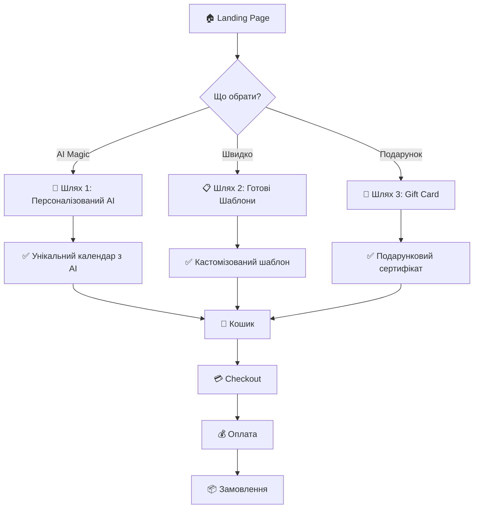
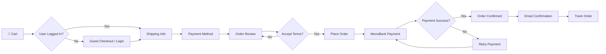

# User Journey - Visual Diagrams

## 🎯 Загальна Концепція: 3 Шляхи до Календаря



---

## 🤖 Шлях 1: AI Magic (Детально)

### Flow Diagram

```
┌─────────────────────────────────────────────────────────────────┐
│                      ШЛЯХ 1: AI MAGIC                          │
└─────────────────────────────────────────────────────────────────┘

1️⃣ LANDING PAGE
   └─> Кнопка "Створити з AI" ───────────────────┐
                                                   ▼
2️⃣ AUTH CHECK                              ┌──────────────┐
   ├─> Є аккаунт? → Login                  │  Onboarding  │
   └─> Немає? → Register ──────────────────>│  (3 слайди)  │
                                            └──────┬───────┘
                                                   ▼
3️⃣ UPLOAD PHOTOS (Wizard Step 1)         ┌────────────────────┐
   ├─> Drag & Drop 10-20 фото             │ "Завантажте фото"  │
   ├─> Preview превью                     │ Progress: 1/5      │
   └─> Валідація (формат, розмір)         └─────────┬──────────┘
                                                     ▼
4️⃣ AI TRAINING (Wizard Step 2)           ┌────────────────────┐
   ├─> Backend створює архів              │ "AI навчається"    │
   ├─> Replicate API тренує модель        │ ⏰ 20-30 хв       │
   ├─> Progress bar + ETA                 │ Can leave & return │
   └─> Email при завершенні               └─────────┬──────────┘
                                                     ▼
5️⃣ CHOOSE THEMES (Wizard Step 3)         ┌────────────────────┐
   ├─> 12 карток місяців                  │ "Оберіть теми"     │
   ├─> Dropdown категорій:                │ Progress: 3/5      │
   │   • Природа                           │ Jan: 🏖️ Beach    │
   │   • Подорожі                          │ Feb: 🏔️ Mountains│
   │   • Сім'я                             │ Mar: 🌸 Spring    │
   │   • Мистецтво                         │ ...               │
   └─> Автопідбір (AI recommendation)     └─────────┬──────────┘
                                                     ▼
6️⃣ GENERATE IMAGES (Wizard Step 4)       ┌────────────────────┐
   ├─> Для кожного місяця викликає        │ "Генерація..."     │
   │   Replicate API з промптом            │ [████████] 8/12   │
   ├─> Паралельна генерація (batch)       └─────────┬──────────┘
   └─> Real-time preview                            ▼
                                          ┌────────────────────┐
7️⃣ REVIEW GALLERY (Wizard Step 5)        │ "Перегляд галереї" │
   ├─> Grid view 12 зображень             │ Progress: 5/5      │
   ├─> Кожне зображення:                  │                    │
   │   • Preview                           │ [Img1] [Img2] ... │
   │   • ♻️ Regenerate button             │ ✏️ Edit  🎨 Done  │
   └─> Кнопки:                             └─────────┬──────────┘
       • "Відкрити в редакторі"                      │
       • "Додати в кошик"                           ▼
                                          ┌────────────────────┐
8️⃣ EDITOR (Optional)                      │  Calendar Editor   │
   └─> Додаткова кастомізація             │  (Phase 4)         │
       • Текст, дати, кольори              └─────────┬──────────┘
       • Стікери, декорації                          ▼
                                          ┌────────────────────┐
9️⃣ CART                                   │   🛒 Shopping Cart │
   └─> Перегляд, promo codes              └─────────┬──────────┘
                                                     ▼
🔟 CHECKOUT → PAYMENT → ORDER               [Загальний процес]
```

### Часові Інтервали

| Етап | Користувач витрачає | Система обробляє |
|------|---------------------|------------------|
| Upload Photos | 5-10 хв | - |
| AI Training | Can leave | 20-30 хв (backend) |
| Choose Themes | 5-10 хв | - |
| Generate Images | Чекає | 3-5 хв (batch) |
| Review Gallery | 5 хв | - |
| Editor (optional) | 10-30 хв | - |
| **Total** | **25-60 хв** | **23-35 хв** |

---

## 📋 Шлях 2: Готові Шаблони (Детально)

### Flow Diagram

```
┌─────────────────────────────────────────────────────────────────┐
│                    ШЛЯХ 2: ШВИДКИЙ СТАРТ                       │
└─────────────────────────────────────────────────────────────────┘

1️⃣ LANDING PAGE
   └─> Кнопка "Обрати шаблон" ──────────────────┐
                                                  ▼
2️⃣ CATALOG                              ┌─────────────────────┐
   ├─> Grid view шаблонів                │  📚 Каталог (20+)  │
   ├─> Filters:                          │                     │
   │   • Категорія                        │ [Filter] [Search]  │
   │   • Стиль                            │                     │
   │   • Колір                            │ [Card] [Card] ...  │
   │   • Ціна                             │ [Card] [Card] ...  │
   ├─> Search bar                         └──────────┬──────────┘
   └─> Sort: Popular / New / Price                   ▼
                                          ┌─────────────────────┐
3️⃣ TEMPLATE PREVIEW                      │  👁️ Preview Modal  │
   ├─> Hover → Quick preview             │                     │
   ├─> Click → Full modal:                │ [Month 1][Month 2] │
   │   • Всі 12 місяців                   │ [Month 3][Month 4] │
   │   • Опис шаблону                     │ ...                │
   │   • Ціна                             │ "Використати" ✅   │
   └─> Кнопка "Використати"               └──────────┬──────────┘
                                                      ▼
4️⃣ QUICK CUSTOMIZE                       ┌─────────────────────┐
   ├─> Базова кастомізація:               │ ⚙️ Налаштування    │
   │   • Вибір кольорів                   │                     │
   │   • Додавання важливих дат           │ Colors: [🔴🟢🔵]  │
   │   • Вибір мови (UK/EN)               │ Dates: [Add]       │
   │   • Початок тижня (Пн/Нд)            │ Language: [UK]     │
   ├─> Preview update в реальному часі    │ Week: [Mon]        │
   └─> Кнопки:                             └──────────┬──────────┘
       • "Зберегти і продовжити" →                   │
       • "Відкрити в редакторі" (для більшого)      ▼
                                          ┌─────────────────────┐
5️⃣ AUTH CHECK (при додаванні в кошик)   │  Auth Required     │
   ├─> Є акаунт? → Login                 │  (Guest checkout   │
   └─> Немає? → Register                 │   опційно)         │
       (або Guest checkout)               └──────────┬──────────┘
                                                      ▼
6️⃣ CART                                  ┌─────────────────────┐
   └─> Додано в кошик                     │  🛒 Cart           │
                                          └──────────┬──────────┘
                                                      ▼
7️⃣ CHECKOUT → PAYMENT → ORDER              [Загальний процес]
```

### Часові Інтервали

| Етап | Час |
|------|-----|
| Browse Catalog | 5-15 хв |
| Template Preview | 2-5 хв |
| Quick Customize | 3-10 хв |
| Cart & Checkout | 5 хв |
| **Total** | **15-35 хв** |

**Переваги:**
- ✅ Швидше за AI (в 2 рази)
- ✅ Без очікування обробки
- ✅ Одразу видно результат
- ✅ Підходить для тих, хто не має фото

---

## 🎁 Шлях 3: Подарунок (Детально)

### Flow Diagram

```
┌─────────────────────────────────────────────────────────────────┐
│                      ШЛЯХ 3: GIFT CARD                         │
└─────────────────────────────────────────────────────────────────┘

1️⃣ LANDING PAGE
   └─> Кнопка "Подарувати" ──────────────────────┐
                                                   ▼
2️⃣ GIFT CARD PAGE                        ┌──────────────────────┐
   ├─> Вибір номіналу:                    │  🎁 Gift Options    │
   │   • 500 грн                           │                      │
   │   • 1000 грн                          │  [500₴] [1000₴]    │
   │   • 1500 грн                          │  [1500₴] [Custom]  │
   │   • Custom amount                     │                      │
   ├─> Опції:                              │  📧 Delivery:       │
   │   • Email delivery                    │  • Email ✅         │
   │   • Physical card                     │  • Physical 📬      │
   ├─> Персоналізація:                     │                      │
   │   • Gift message                      │  Message: [____]    │
   │   • Sender name                       │  From: [____]       │
   │   • Delivery date                     │  Date: [____]       │
   └─> Preview gift card design            └───────────┬──────────┘
                                                       ▼
3️⃣ AUTH (якщо потрібно)                   [Login/Register]
                                                       ▼
4️⃣ CART & CHECKOUT                        ┌──────────────────────┐
   └─> Стандартний процес                  │  Checkout           │
                                           └───────────┬──────────┘
                                                       ▼
5️⃣ PAYMENT                                ┌──────────────────────┐
   └─> MonoBank оплата                     │  💳 Payment         │
                                           └───────────┬──────────┘
                                                       ▼
6️⃣ GIFT DELIVERY                          ┌──────────────────────┐
   ├─> Email option:                       │  📧 Delivery        │
   │   • Email з gift code                 │                      │
   │   • Beautiful template                │  Gift Code:         │
   │   • Redeem link                       │  GIFT-XXXX-YYYY    │
   └─> Physical option:                    │                      │
       • Доставка Новою Поштою              │  Redeem at:         │
       • Красива картка                     │  calendary.com.ua  │
                                           └──────────────────────┘
```

### Gift Code Redemption Flow

```
1️⃣ Одержувач отримує Email/Card
   └─> Містить gift code: GIFT-XXXX-YYYY

2️⃣ Переходить на calendary.com.ua/redeem
   └─> Вводить код

3️⃣ Система перевіряє код
   ├─> Valid? → Додає кредити/баланс
   └─> Invalid? → Error message

4️⃣ Користувач може:
   ├─> Створити AI календар (Шлях 1)
   ├─> Обрати шаблон (Шлях 2)
   └─> Закріпити за акаунтом (якщо не залогінений)
```

---

## 🛒 Загальний Checkout Flow (для всіх шляхів)



### Checkout Steps Details

#### Step 1: Cart Review
```
┌─────────────────────────────────────────┐
│  🛒 Shopping Cart                      │
├─────────────────────────────────────────┤
│  Item: AI Calendar "Summer Vibes"      │
│  Quantity: 1                            │
│  Price: 499 грн                         │
│                                         │
│  Promo Code: [_______] [Apply]         │
│  -50 грн discount                       │
│                                         │
│  Subtotal: 449 грн                     │
│  Delivery: Calculate at checkout       │
│                                         │
│  [Continue Shopping] [Checkout →]      │
└─────────────────────────────────────────┘
```

#### Step 2: Shipping (Nova Poshta)
```
┌─────────────────────────────────────────┐
│  📦 Shipping Information               │
├─────────────────────────────────────────┤
│  Місто: [Київ ▼]                       │
│         (Autocomplete з Nova Poshta)    │
│                                         │
│  Відділення: [Відділення №15 ▼]       │
│              (List з API)               │
│                                         │
│  Контакти:                              │
│  Ім'я: [________________]              │
│  Телефон: [+380__________]             │
│  Email: [________________]              │
│                                         │
│  Delivery Cost: 60 грн                 │
│  Total: 509 грн                        │
│                                         │
│  [← Back] [Continue →]                 │
└─────────────────────────────────────────┘
```

#### Step 3: Payment
```
┌─────────────────────────────────────────┐
│  💳 Payment Method                     │
├─────────────────────────────────────────┤
│  ⚪ MonoBank (Online)                   │
│     Visa, Mastercard, Google Pay        │
│                                         │
│  ⚪ Cash on Delivery                    │
│     Pay when you receive (+ 20 грн)    │
│                                         │
│  Order Summary:                         │
│  Products: 449 грн                     │
│  Delivery: 60 грн                      │
│  Total: 509 грн                        │
│                                         │
│  [← Back] [Place Order →]              │
└─────────────────────────────────────────┘
```

#### Step 4: Order Confirmation
```
┌─────────────────────────────────────────┐
│  ✅ Order Confirmed!                    │
├─────────────────────────────────────────┤
│  Order #12345                           │
│  Date: 2025-11-16 20:30                │
│                                         │
│  We sent confirmation to:               │
│  📧 your-email@example.com             │
│                                         │
│  What's next?                           │
│  1. We print your calendar (1-2 days)  │
│  2. Send to Nova Poshta (1 day)        │
│  3. Delivery (1-3 days)                │
│                                         │
│  Estimated delivery: Nov 20-23          │
│                                         │
│  [Track Order] [Download PDF]           │
│  [Continue Shopping]                    │
└─────────────────────────────────────────┘
```

---

## 📊 Conversion Funnel Analysis

### AI Path Funnel
```
Landing Page (100%)
    ↓ -40%
Register/Login (60%)
    ↓ -20%
Upload Photos (48%)
    ↓ -15% (abandon during training)
Choose Themes (41%)
    ↓ -10%
Generate Images (37%)
    ↓ -5%
Review Gallery (35%)
    ↓ -10%
Add to Cart (31.5%)
    ↓ -40% (cart abandonment)
Purchase (19%) ← Target >20%
```

**Drop-off Points:**
- 🔴 Register → Upload: 20% (треба покращити onboarding)
- 🔴 Training Wait: 15% (email notification важлива)
- 🔴 Cart Abandonment: 40% (стандартно, треба remarketing)

### Template Path Funnel
```
Landing Page (100%)
    ↓ -30%
Catalog (70%)
    ↓ -20%
Template Preview (56%)
    ↓ -15%
Quick Customize (48%)
    ↓ -10%
Add to Cart (43%)
    ↓ -35% (cart abandonment)
Purchase (28%) ← Target >30%
```

**Переваги Template Path:**
- ✅ Вища конверсія (28% vs 19%)
- ✅ Швидший процес
- ✅ Менше drop-off points

---

## 🎯 Priority Recommendations

### Must Have (Sprint 1-2):
1. **Onboarding** для AI path - зменшить drop-off на 10%
2. **Email Notification** після AI training - повернути 15% користувачів
3. **Progress Saving** - можливість повернутися пізніше
4. **Cart Optimization** - зменшити abandonment до 30%

### Should Have (Sprint 3-4):
5. **Catalog Filters** - покращити UX пошуку шаблонів
6. **Quick Customize** - прискорити template path
7. **Mobile Responsive** - 40%+ трафіку з mobile

### Nice to Have (Sprint 5+):
8. **Social Login** - зменшити friction на register
9. **Gift Cards** - додатковий revenue stream
10. **Referral Program** - organic growth

---

**Дата створення**: 2025-11-16
**Версія**: 1.0
